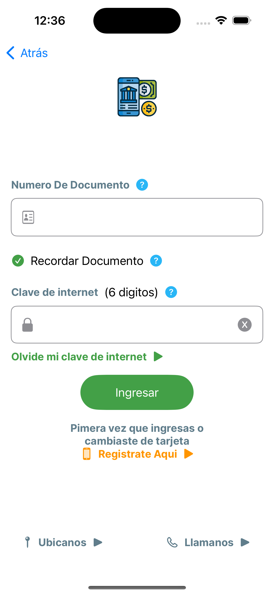
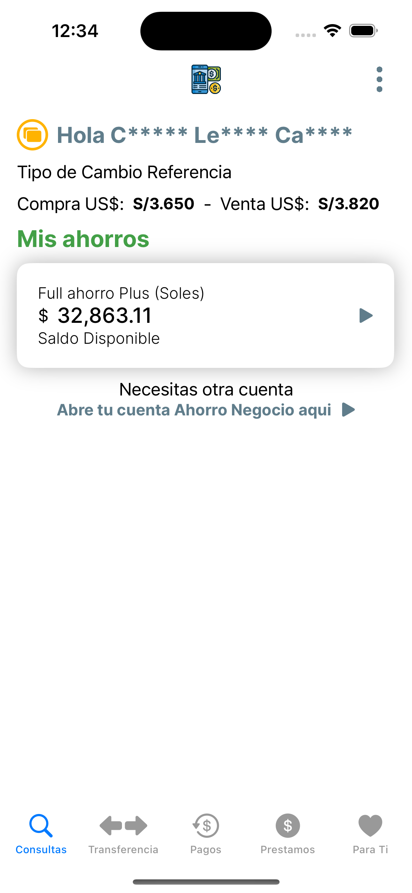
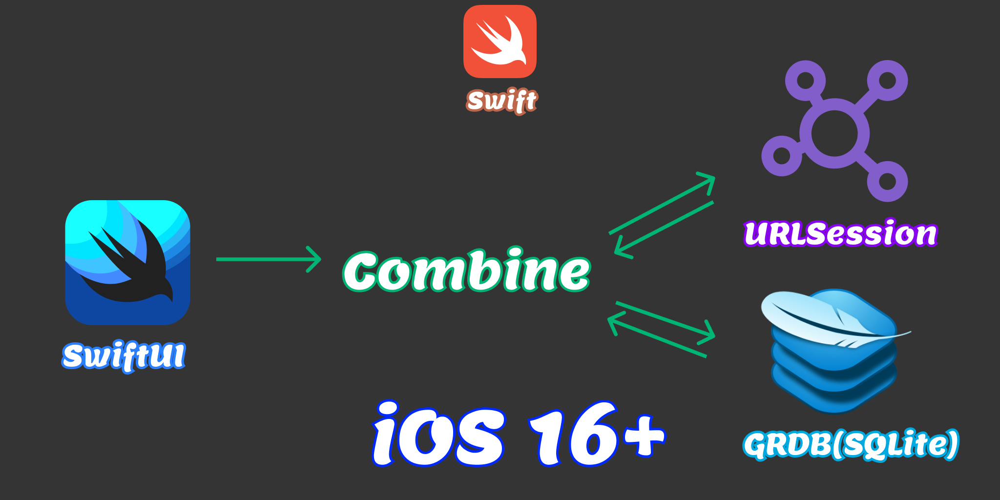
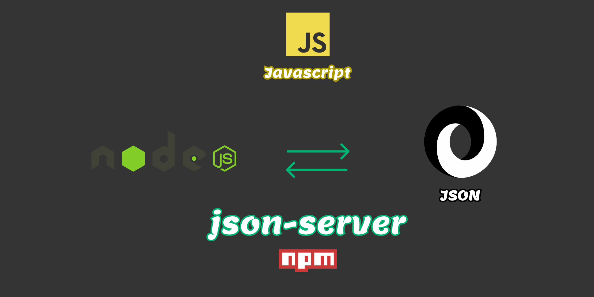

#  Aplicacion de Banco
Esta aplicación permite al usuario iniciar sesión, registrarse, verificar saldo, cuentas, transferencias, etc. 

<p align="center">
    
    
    
</p>

#  Arquitectura de la aplicación iOS
<p align="center">
    
</p>

#  Arquitectura de la aplicación Servidor
<p align="center">
    
</p>

## Running the server

1. Install node
2. Move to the `server` folder 
3. To install libraries, run `npm install`
3. To start the server just run: `node index.js`
4. To stop the server just type: `control + c`


## Running the app

### Prerequisites

1. Go back to the root folder.
2. Instala Homebrew.
3. Instala SwiftGen

```sh
brew update
brew install swiftgen
```

4. Verifica que tienes instalado swiftgen

```sh
switfgen --version
SwiftGen v6.6.2 (Stencil v0.15.1, StencilSwiftKit v2.10.1, SwiftGenKit v6.6.2)
```

5. Instala SwiftLint

```sh
brew install swiftlint
```

6. Verifica que tienes swiftlint instalado

```sh
swiftlint --version
0.53.0
```

7. Instala Sourcery

```sh
brew install sourcery
2.1.2
```


## Libraries

* SwiftGen
* SwiftLint 
* netfox
* Sourcery
* ShowTime
* Factory

## Especificaciones

1. Soporte iOS version: 16.0
2. Soporte para plataformas iPhone y iPad
